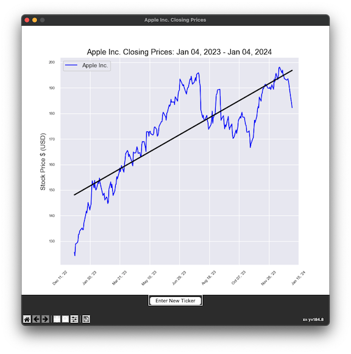
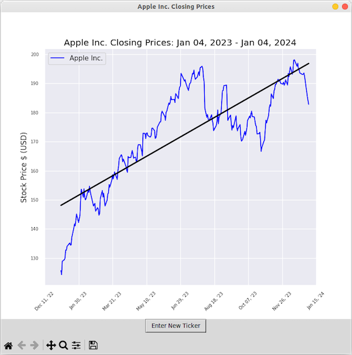

# StockLookup
A python3 script in which a user is promted to enter a stock ticker and a number of days. Matplotlib is then used to display a plot of the adjusted closing prices for the number of days specified.

### Modules
#### displayData.py:
This module creates a window using tkinter. Matplotlib is then used to plot data within the tkinter window. Tkinter is also used to ask the 
user for a stock ticker and the number of days for which to looking up data for. Though this module does not use yfinance, it is used by module getCompanyData and is therefore listed as a requirement.
##### Requires: 
- Tcl/Tk
- matplotlib
- seaborn
- pandas

#### getCompanyData.py-  
This script uses yFinance to get financial data then saves the data to a xlsx file using openpyxl.  Requires a .csv file with stock ticker/company name(stocktickers.csv).  Produces .xlsx file (myStocks.xlsx) with a tab for each company listed in the stocktickers.csv file.
##### Requires: 
- yfinance
- requests
- re

#### getTicker.py- 
A set of scripts that use yfinance to get the last x days of stock data for provided stocks and uses matplotlib to plot the adjusted closing prices
##### Requires: 
- Tcl/Tk

#### numDays.py
This script uses tkinter to ask the user which of the stocks found in file stockktickers.csv to look up data for.  User has the option of adding a trend line to the plot.  Lookups can be from 2 to 10,000 days.
##### Requires: 
- tkinter: Tcl/Tk 8.6

